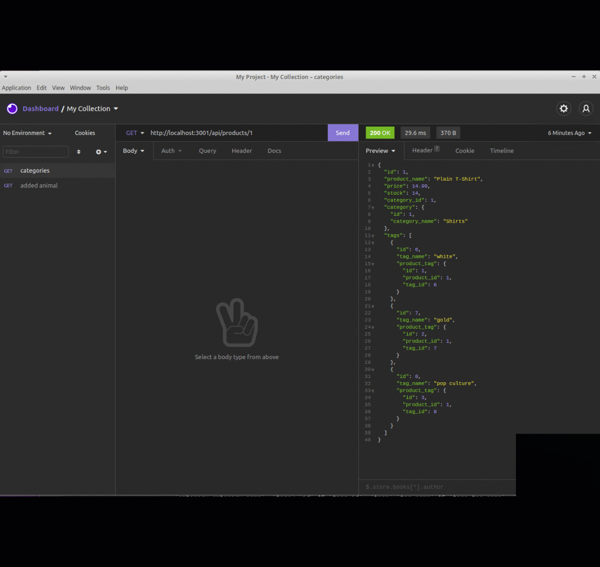

# e-commerce-back-end
## Description
This application build the back end for an e-commerce site. It took a working Express.js API and configure it to use Sequelize to interact with a MySQL database.

## User Story
* AS A manager at an internet retail company
* I WANT a back end for my e-commerce website that uses the latest technologies
* SO THAT my company can compete with other e-commerce companies

## Acceptance Criteria
GIVEN a functional Express.js API 
WHEN I add my database name, MySQL username, and MySQL password to an environment variable file 
THEN I am able to connect to a database using Sequelize 
WHEN I enter schema and seed commands 
THEN a development database is created and is seeded with test data 
WHEN I enter the command to invoke the application 
THEN my server is started and the Sequelize models are synced to the MySQL database 
WHEN I open API GET routes in Insomnia Core for categories, products, or tags 
THEN the data for each of these routes is displayed in a formatted JSON 
WHEN I test API POST, PUT, and DELETE routes in Insomnia Core 
THEN I am able to successfully create, update, and delete data in my database 

## Languages
HTML, CSS, JavaScript, Node.js, Express.js, Npm Modules, dotenv Package, Sequelize, MySQL2

## Installation
The application require the use of node.js, Express.js, Sequelize & MySQL2 for running it.

## To Run the Application
Add a .env file to the root folder that contain the following: 
DB_NAME='ecommerce_db' 
DB_USER='new_user' 
DB_PW='XXXXXX' 

## Walkthrough Videos
Create Schema and Seed Data
 
GET routes - Return all Categories, Products and Tags
 
GET routes - Return single Category, Product or Tag
 
Categories routes - Post, Put and Delete
 
Products routes - Post, Put and Delete
 
Tags routes - Post, Put and Delete
 

## Demonstration Videos
https://drive.google.com/drive/folders/1LUoVF3PZhso4GpKp_ERdaL-gAf1d10hQ?usp=sharing

## Github Page: 
https://github.com/amykep/e-commerce-back-end